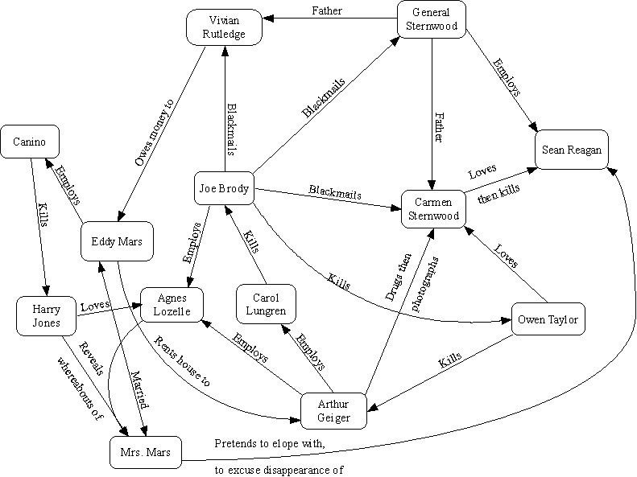

One of my top <em>n</em> favourite films is "The Big Sleep", staring Humphrey Bogart and Lauren Bacall, and based on a novel by Raymond Chandler. The film is well known for having a particularly convoluted plot, but having seen it many times now, I feel that I understand at least the bare bones. It is therefore my duty as a human being to share this Hermetic wisdom with my fellow mortals. To wit, a diagram below summarising who does what to whom, and who is related to whom. And how. Fans of the film may notice that Philip Marlowe isn't mentioned here. That's because he doesn't really do a lot, despite being on screen practically the whole time. He is the observer. He is Us, observing Them. 

I'll probably update next time I watch the movie, because all my opinions will have changed by then, I'm sure.

I'm glad that's all clear now...

August 2001

