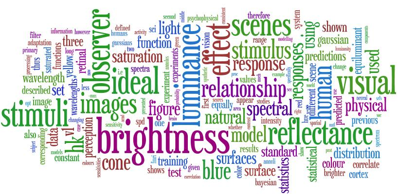
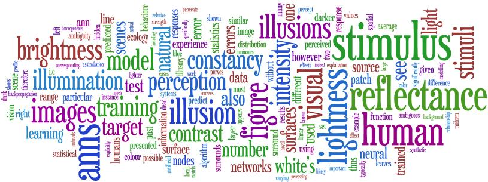
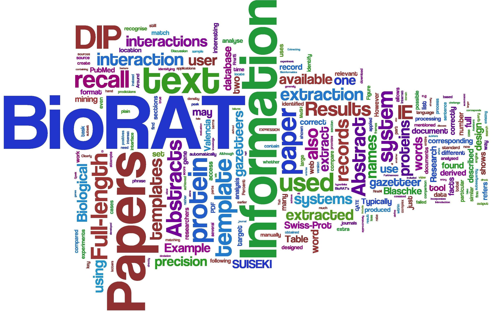
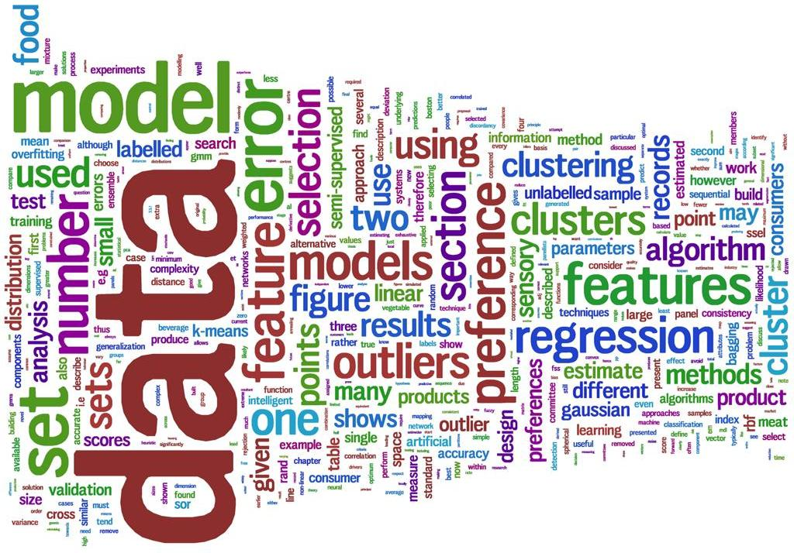

I've recently been playing around with <a href="http://www.wordle.net/">Wordle</a>, "a toy for generating <i>word clouds</i> from text." Below are a few examples based on a few of my recent papers, and also my PhD thesis. Each picture is made from the words of the documents, arranged so that the words that I (and my co-authors) used more often come out bigger.

A paper of mine on the Helmholtz-Kohlrauch effect, called "The Brightness of Colour":

 

Our paper on lightness illusions, from 2007:

 

A slightly older paper on information extraction from biomedical text, using a system called 'BioRAT': (click for a larger version)

 

And finally, my PhD thesis, on food design using various statistical and computational approaches: (click for a larger version)

 

 

Now go and play with <a href="http://www.wordle.net/">Wordle</a> yourself! It's quick, easy and fun!
 

